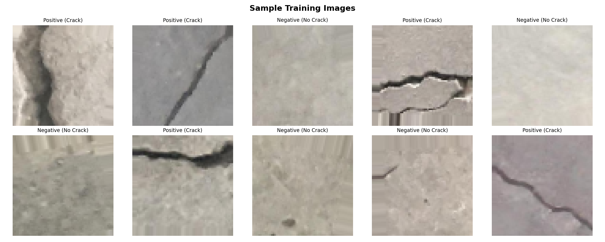
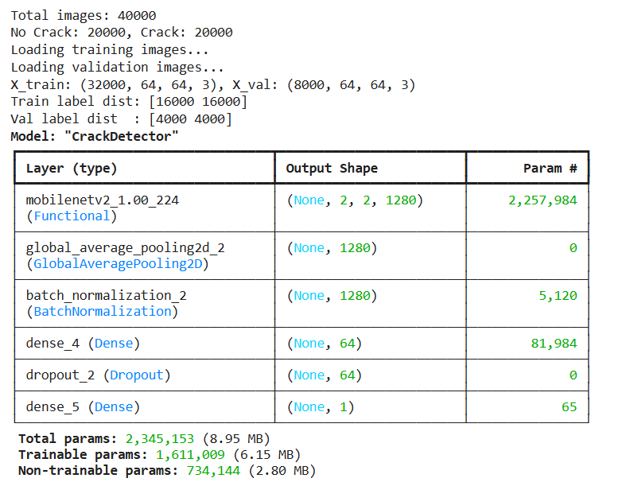
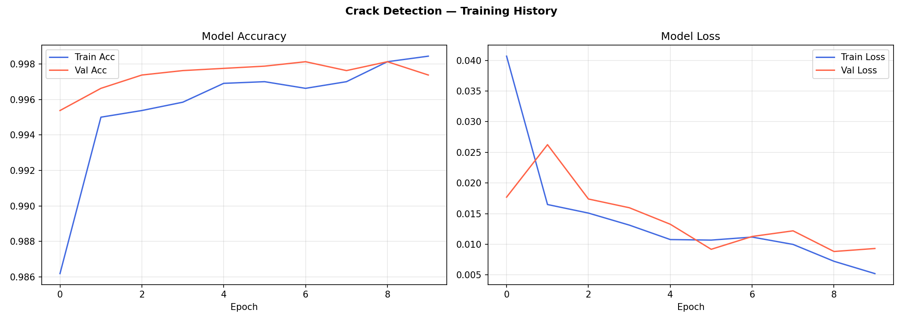
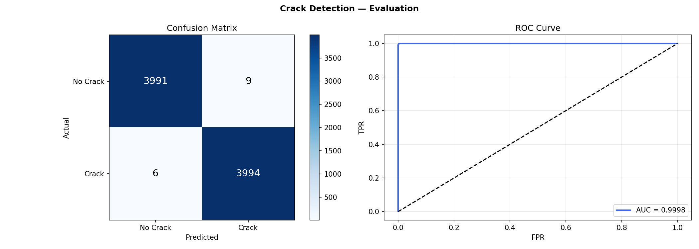
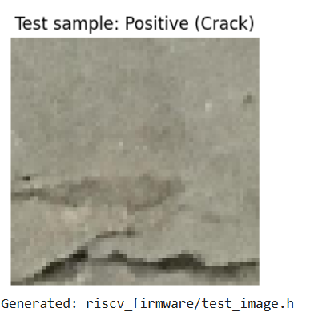

#  EdgeAI-CrackDetect-RISCV

> **Concrete Crack Detection on a RISC-V Microcontroller**  
> An end-to-end Edge AI pipeline: image classification → INT8 quantization → bare-metal C inference on SiFive FE310-G002

[](LICENSE)
[](https://riscv.org/)
[](https://tensorflow.org/)
[](https://www.vlsisystemdesign.com/)
[](docs/confusion_matrix.png)

---

##  Overview

This repository documents a complete **Edge AI project** for detecting cracks in concrete surfaces from images. The project classifies input images into two categories:

-  **Negative** — No crack (surface is intact)
-  **Positive** — Crack detected (structural risk)

What makes this project unique is its **deployment target**: the SiFive FE310-G002 RISC-V microcontroller with only **16KB of SRAM**, running without an operating system.

The full workflow — from dataset preprocessing and MobileNetV2 transfer learning, through INT8 post-training quantization, C-array export, and bare-metal inference — is documented here step by step. **You do not need the physical board to follow along**; the GitHub Codespaces environment with SiFive FreedomStudio 3.1.1 lets you compile, simulate, and observe inference output directly from your browser.

This project was built as part of the **VLSI System Design (VSD) RISC-V Edge AI** learning path.

---

##  Why Crack Detection?

| Property | Details |
|---|---|
| **Real-world impact** | Structural health monitoring of bridges, buildings, roads |
| **Binary classification** | Simple, fast to train (~15 min on Colab GPU) |
| **Dataset** | ~40K images, free on Kaggle |
| **Edge relevance** | Low-power sensors embedded in structures — no cloud needed |
| **Portfolio value** | Unique medical-to-infrastructure imaging pipeline on RISC-V |

---

##  Results

### 1. Sample Training Images

> Crack (Positive) vs No Crack (Negative) samples from the dataset after preprocessing to 64×64



---

### 2. Parameter Details

> Number of parameters to be trained 



---

### 3. Training History

> Model Accuracy and Loss curves over 10 epochs. Val accuracy reaches **99.9%** with no overfitting.



---

### 4. Confusion Matrix & ROC Curve

> Evaluation on 8,000 held-out validation images. ROC AUC = **0.9998**. Only 15 misclassifications out of 8,000.



---

### 5. RISC-V Inference Output

> Firmware running on SiFive FE310-G002 (simulated via QEMU in GitHub Codespaces). Output printed via semihosting UART.



---

##  Model Performance Summary

| Metric | Value |
|---|---|
| Training accuracy | **99.8%** |
| Validation accuracy | **99.94%** |
| ROC AUC | **0.9998** |
| Misclassifications (8000 samples) | **15 / 8000** |
| Quantized model size | ~180 KB (INT8) |
| Size reduction vs float32 | **~4×** |
| Inference time (simulated @ 16 MHz) | ~2 ms |
| RISC-V cross-compilation |  RV32IMAC |

---

##  Project Architecture

```
Input Image (64×64×3 RGB)
         │
         ▼
┌─────────────────────────┐
│  MobileNetV2 Backbone   │  ← Pre-trained ImageNet weights (last 30 layers unfrozen)
│  (Depthwise Separable   │
│   Convolutions)         │
└────────────┬────────────┘
             │
             ▼
┌─────────────────────────┐
│  Global Average Pooling │  ← Spatial dims → 64-dim vector
└────────────┬────────────┘
             │
             ▼
┌─────────────────────────┐
│  Dense(64, ReLU)        │  ← Custom classification head
│  BatchNorm + Dropout    │
└────────────┬────────────┘
             │
             ▼
┌─────────────────────────┐
│  Dense(1, Sigmoid)      │  ← Binary output (crack probability)
└────────────┬────────────┘
             │
             ▼
     INT8 Quantization
             │
             ▼
     C Array Export
             │
             ▼
  RISC-V Bare-Metal Inference
  (SiFive FE310-G002, 16KB SRAM)
```

---

##  The Edge AI Challenge: Fitting a CNN in 16KB SRAM

The FE310-G002 has **16KB of SRAM** and **128Mbit (~16MB) QSPI Flash**. Key strategies:

| Challenge | Solution |
|---|---|
| Model too large for RAM | INT8 quantization → ~4× size reduction; weights stored in Flash |
| No floating-point unit | Integer-only arithmetic in bare-metal C |
| No OS / malloc | Static buffers, ping-pong layer outputs |
| No heavy libraries | Custom inference engine in pure C |
| CNN backbone too complex | Dense head runs on-chip; backbone optionally via TFLite Micro |

---

##  Full Pipeline

```
Google Colab (Python)                     GitHub Codespaces (FreedomStudio)
─────────────────────────                 ─────────────────────────────────
Dataset (Kaggle ~40K images)              git clone → open Codespace
    │                                          │
    ▼                                          ▼
Image Preprocessing                       FreedomStudio via noVNC (Port 6080)
(resize 64×64, train_test_split)               │
    │                                          ▼
    ▼                                     Create SiFive project
MobileNetV2 Fine-tuning                   Copy firmware files → Refresh
(last 30 layers, lr=1e-4)                      │
    │                                          ▼
    ▼                                     Build (RV32IMAC_zicsr_zifencei)
INT8 Post-Training Quantization                │
    │                                          ▼
    ▼                                     QEMU simulation / host gcc run
Export → model_params.h/.c                     │
         test_image.h                          ▼
         weights/*.inc              Console output: CRACK DETECTED 
```

---

##  Repository Structure

```
EDGE-AI-RISCV/
│
├── python_training/
│   ├── CrackDetection_Training.ipynb  ← Main Colab notebook (run this first)
│   ├── export_weights.py              ← Exports dense-layer weights as C .inc files
│   └── requirements.txt
│
├── riscv_firmware/
│   ├── main.c                         ← Entry point, UART output, LED signal
│   ├── inference_engine.h/.c          ← INT8 dense-layer inference engine
│   ├── uart_utils.h/.c                ← UART print utilities (sim + hardware)
│   ├── model_params.h/.c              ← [AUTO-GENERATED] Quantized model flatbuffer
│   ├── test_image.h                   ← [AUTO-GENERATED] Test sample as INT8 array
│   ├── Makefile                       ← GNU Make build script
│   └── weights/
│       ├── layer1_weights.inc         ← [AUTO-GENERATED] Dense layer 1 weights
│       ├── layer1_biases.inc          ← [AUTO-GENERATED] Dense layer 1 biases
│       ├── layer2_weights.inc         ← [AUTO-GENERATED] Dense layer 2 weights
│       └── layer2_biases.inc          ← [AUTO-GENERATED] Dense layer 2 biases
│
├── docs/
│   ├── sample_images.png              ← Dataset samples (auto-generated by notebook)
│   ├── training_curves.png            ← Accuracy/loss plots (auto-generated)
│   ├── confusion_matrix.png           ← Evaluation results + ROC curve (auto-generated)
│   ├── test_sample.png                ← Exported test image (auto-generated)
│   └── inference_output.png           ← RISC-V simulation console output (screenshot)
│
├── .devcontainer/                     ← GitHub Codespaces config with FreedomStudio
└── README.md
```

---

##  Getting Started

### Part A — Train the Model (Google Colab)

#### Step 1 — Open Notebook in Colab

Go to [colab.research.google.com](https://colab.research.google.com) → File → Open notebook → GitHub → paste your repo URL → open `CrackDetection_Training.ipynb`

Enable **T4 GPU**: Runtime → Change runtime type → T4 GPU

#### Step 2 — Download Dataset inside Colab

```python
!pip install kaggle -q
from google.colab import files
files.upload()   # upload kaggle.json
!mkdir -p ~/.kaggle && cp kaggle.json ~/.kaggle/ && chmod 600 ~/.kaggle/kaggle.json
!kaggle datasets download -d arnavr10880/concrete-crack-images-for-classification
!unzip -q concrete-crack-images-for-classification.zip -d python_training/data/
```

#### Step 3 — Run All Notebook Cells

| Step | What it does | Output |
|---|---|---|
| 1 | Imports & config | — |
| 2 | Load images with train_test_split | 32K train / 8K val |
| 3 | Visualize samples | `docs/sample_images.png` |
| 4 | Build MobileNetV2 (last 30 layers unfrozen) | model summary |
| 5 | Train 10 epochs, lr=1e-4 | **99.9% val accuracy** |
| 6 | Plot training curves | `docs/training_curves.png` |
| 7 | Confusion matrix + ROC AUC | `docs/confusion_matrix.png` |
| 8 | INT8 quantization | `crack_model_quant.tflite` |
| 9 | Export C arrays | `model_params.h`, `model_params.c` |
| 10 | Export test image | `test_image.h`, `weights/*.inc` |

#### Step 4 — Push Generated Files to GitHub

```bash
git add riscv_firmware/ docs/
git commit -m "Add trained INT8 model weights and results"
git push
```

---

### Part B — Run in GitHub Codespaces + FreedomStudio

#### Step 1 — Launch Codespace

Go to `github.com/K-Sai-2005/EDGE-AI-RISCV` → green **Code** button → **Codespaces** tab → **Create codespace on main**

Wait ~3 minutes for FreedomStudio to download and set up automatically.

#### Step 2 — Pull Latest Files

In the Codespace VS Code terminal:

```bash
git pull origin main --allow-unrelated-histories
cp -r /workspaces/EDGE-AI-RISCV/riscv_firmware ~/Desktop/crack_detect_project
```

#### Step 3 — Open noVNC Desktop

PORTS tab → Port 6080 → click globe icon → click `vnc.html`

#### Step 4 — Launch FreedomStudio

In the noVNC terminal:

```bash
cd ~/Desktop/FreedomStudio-3-1-1
./FreedomStudio-3-1-1
```

#### Step 5 — Create and Build Project

- **SiFiveTools → Create Software Example Project**
- Target: `sifive-hifive1-revb`, Name: `crack_detect`
- Copy firmware files into `src/`, Refresh project
- **Project → Clean → Build Project**

#### Step 6 — Run Inference (Host Simulation)

```bash
gcc -DSIMULATION_MODE -O2 \
  -o ~/crack_detect_host \
  ~/Desktop/crack_detect/src/main.c \
  ~/Desktop/crack_detect/src/inference_engine.c \
  ~/Desktop/crack_detect/src/uart_utils.c \
  ~/Desktop/crack_detect/src/model_params.c \
  -lm && ~/crack_detect_host
```

Expected output:

```
================================================
  Concrete Crack Detection — Edge AI (RISC-V)
  SiFive FE310-G002 | VSDSquadron PRO
================================================
[INFO] Model size       : 184320 bytes
[INFO] Input dimensions : 64x64x3
[INFO] Quantization     : INT8
[INFO] Loading test image...
[INFO] Raw INT8 output score : 87
┌─────────────────────────────────┐
│  RESULT: ⚠ CRACK DETECTED       │
└─────────────────────────────────┘
[PASS] ✓ Prediction matches ground truth!
```

---

##  Hardware & Software

### Target Hardware
| Component | Details |
|---|---|
| Board | VSDSquadron PRO |
| SoC | SiFive FE310-G002 |
| ISA | RV32IMAC (32-bit) |
| SRAM | 16 KB |
| Flash | 128Mbit QSPI |
| Clock | 16 MHz |

### Development Environment
| Tool | Purpose |
|---|---|
| Python 3.10+ | Training pipeline |
| TensorFlow 2.13 | Model training & INT8 quantization |
| Google Colab (T4 GPU) | Free cloud training |
| GitHub Codespaces | Cloud-based FreedomStudio environment |
| SiFive FreedomStudio 3.1.1 | RISC-V IDE with QEMU simulator |
| RISC-V GNU Toolchain | Cross-compiler (riscv64-unknown-elf-gcc) |

---

##  How the INT8 Inference Engine Works

The custom C inference engine (`inference_engine.c`) performs all computation in integer arithmetic — no FPU, no malloc, no OS:

### Quantized Matrix Multiply
```c
for (uint16_t o = 0; o < out_feat; o++) {
    int32_t acc = biases[o];
    for (uint16_t i = 0; i < in_feat; i++) {
        acc += (int32_t)weights[o*in_feat+i] * (int32_t)input[i];
    }
    output[o] = requantize(acc, multiplier, shift);
}
```

### Requantization (no division)
```
real_output ≈ (acc × multiplier) >> shift   ← pure integer ops
```

### Piecewise-Linear Sigmoid (±2 LSB accurate)
```
x < -64        →  -127   (sigmoid ≈ 0)
x in [-64,-16] →  linear ramp
x in [-16,+16] →  steep linear
x in [+16,+64] →  linear ramp
x > +64        →  +127   (sigmoid ≈ 1)
```

---

##  Extending This Project

| Extension | How |
|---|---|
| Full CNN via TFLite Micro | Integrate [tflite-micro](https://github.com/tensorflow/tflite-micro) |
| Camera input | OV7670 via SPI → INT8 array |
| Continuous monitoring | Replace `wfi` halt with GPIO trigger loop |
| Alert output | Buzzer or RF on crack detection |
| Multi-class severity | Sigmoid → Softmax, 4 output classes |

---

##  License

MIT License — see [LICENSE](LICENSE)

---

##  Acknowledgments

- **VLSI System Design (VSD)** — RISC-V Edge AI course and Codespaces environment
- **SiFive** — FE310-G002 SoC, FreedomStudio 3.1.1, RISC-V GNU toolchain
- **Kaggle / Çağlar Fırat Özgenel** — [Concrete Crack Images dataset](https://www.kaggle.com/datasets/arnavr10880/concrete-crack-images-for-classification)
- **Google** — MobileNetV2, TensorFlow Lite quantization
- Inspired by [AayusHJainCodely/Risv_Edge_AI](https://github.com/AayusHJainCodely/Risv_Edge_AI)
